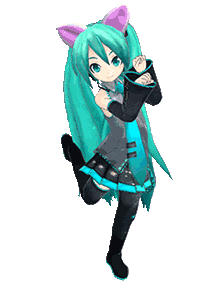
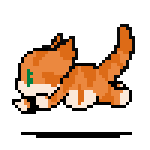
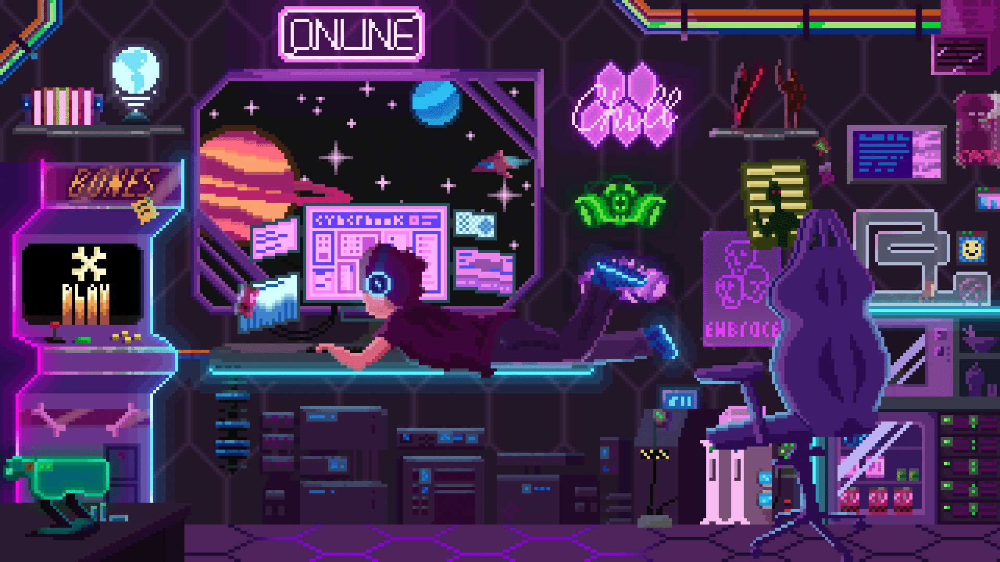

    
    
    

 

    
    
    

 👋 Hi, I’m Ernest!    
 🎓 I’m a passionate Computer Science student with a keen interest in web development, algorithms, and problem-solving. I love exploring new technologies and building projects that challenge me to grow as a developer.  
   🔭 I’m currently working on Web development and Mobile apps.    
   🌱 I’m learning Python, Java, Javascript, Html, and Css.    
   👯 I’m looking to collaborate on open-source projects or innovative tech solutions.     
   🤔 I’m always open to discussing new ideas or solving interesting problems.   
   🌟 When I'm not coding, you can find me playing moba games, watching movies or crypto trading.

  Let’s connect and build something amazing together! 😄

    <h3> 
        <strong>
             
            Languages, 
            Frameworks, and 
            Tools that I tried! 
             
        </strong>
    </h3>

        
        
        
        
        
        
        
        
        
        
        
        
        
        
        
        
        
        
        
        
        
        

    <h2>
        📊 GitHub Stats
    </h2>
    
    
    

    

    

    
    
    

 

  <h1>
    <strong>
      
      
        My Favorite Anime
      
      
    </strong>
  </h1>

  <ul style="list-style: none; padding: 0; font-size: 20px; color: #ffffff;">
    
    <li>Solo Leveling</li>
    
    
    <li>One Piece</li>
    
    
    <li>Demon Slayer</li>
    
    
    <li>Jujutsu Kaisen</li>
    
    
    <li>Naruto</li>
    
    
  </ul>

