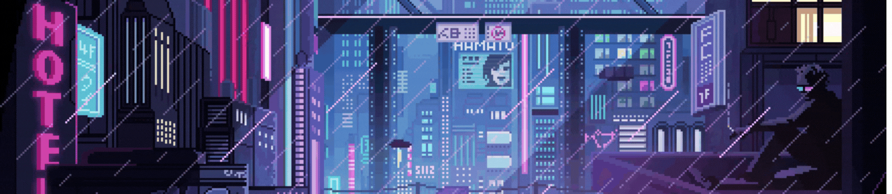
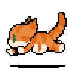
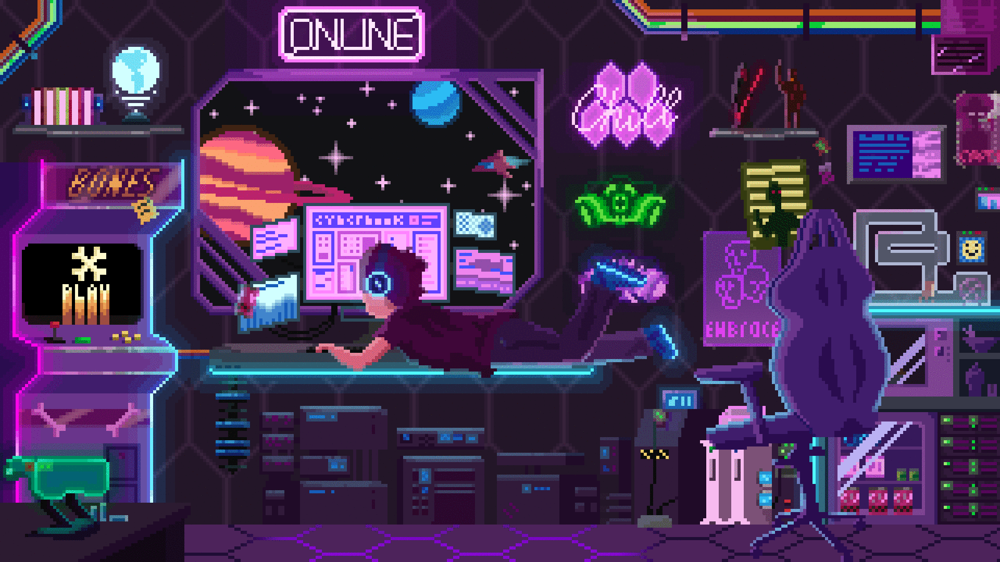
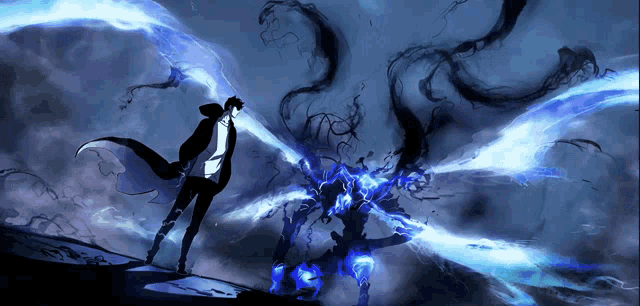
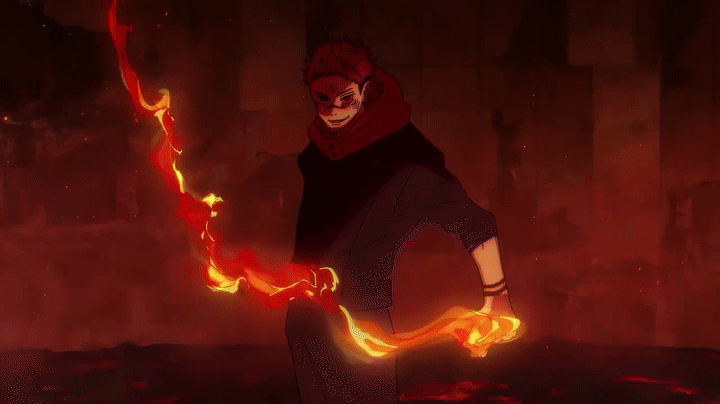

    
    
    

  
  
  
  

 

    

 

    <h3>
        <strong>
            👋 Hi, I'm Ernest!
        </strong>
    </h3>

I'm a **Junior Full-Stack Software Developer** passionate about building modern web applications, AI-powered solutions, and scalable backend systems. I enjoy solving real-world problems through clean, efficient code while continuously learning new technologies and software engineering practices. I'm currently working with **React, Vite, TailwindCss, Python, FastAPI, MySQL, and Railway**, and I'm expanding my knowledge in **System Design, Microservices, Cloud Computing, DevOps, and Artificial Intelligence**. I'm always open to collaborating on innovative projects, contributing to open source, and connecting with fellow developers. Outside of coding, I enjoy exploring Web3 and AI, working on personal projects, watching movies, playing MOBA games, and crypto trading.

    <h3>
        <strong>
            Let's build something impactful together. 🚀
        </strong>
    </h3>

     

    <h3>
        <strong>
            
            Languages |
            Frameworks |
            Databases |
            Tools &
            Technologies
            
        </strong>
    </h3>

  <!-- Languages -->
  
  
  
  
  
  
  

   

  <!-- Frontend -->
  
  
  
  
  

   

  <!-- Backend -->
  
  

   

  <!-- Databases -->
  
  
  

   

  <!-- AI / Data Science -->
  
  
  
  
  

   

  <!-- Tools -->
  
  
  
  
  
  

   

  <!-- Deployment -->
  
  

    <h3>
        <strong>
            
            📊 GitHub Stats
            
        </strong>
    </h3>

    
    
    

    

    
    
    

 

  <h1>
    <strong>
      
      
        My Favorite Anime
      
      
    </strong>
  </h1>

  <ul style="list-style: none; padding: 0; font-size: 20px; color: #ffffff;">
    
    <li>Solo Leveling</li>
    
    
    <li>One Piece</li>
    
    
    <li>Demon Slayer</li>
    
    
    <li>Jujutsu Kaisen</li>
    
    
    <li>Naruto</li>
    
    
  </ul>

